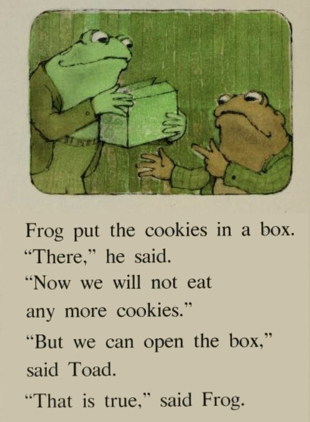

<!-- README.md is generated from README.Rmd. Please edit that file -->

```{r, include = FALSE}
knitr::opts_chunk$set(
  collapse = TRUE,
  comment = "#>",
  fig.path = "man/figures/README-",
  out.width = "100%"
)
```

# nonempty

<!-- badges: start -->
<!-- badges: end -->

Constructs a strictly non-empty structure that cannot be made empty.

## Installation

You can install the development version of {nonempty} like so:

``` r
# install.packages("remotes")
remotes::install_github("jonocarroll/nonempty")
```

{nonempty} is dependency-free and relies entirely on S4 object validation.

## Motivation

This blog post [https://lexi-lambda.github.io/blog/2019/11/05/parse-don-t-validate/][parse] makes 
the point that functions need to deal with edge-cases of inputs being `NULL`. Even 
in languages without an explicit `NULL` (e.g. Haskell has `Maybe`, Rust has `Option`) 
functions still need to deal with the possibility of `Nothing`, `None`, or whatever the missing 
keyword is.

The example given there is a `head` function in Haskell, which is a strongly-typed language
and so needs to handle the output being either a value, or `Nothing`, depending on whether 
the input _has_ a first value, or is an empty list (`[]`)

```haskell
head :: [a] -> Maybe a
head (x:_) = Just x
head []    = Nothing
```

R, not being strongly-typed, doesn't have a type-safe return value, so it can return 
either a value, or `NULL`

```{r}
head(c(3, 4, 5), 1)
head(NULL)
```

The alternative propsed is to use a nonempty type consisting of a "definitely present" first 
value, along with a regular list (which may be empty)

```haskell
data NonEmpty a = a :| [a]
```

in which case, the return type of `head` can be guaranteed

```haskell
head :: NonEmpty a -> a
head (x:|_) = x
```

This `nonEmpty` type has the benefit that it can be safely assumed to be just that - not empty.
Passing a `nonEmpty` structure to a function would not require testing if it is currently 
`NULL` - it is not.

To that end, {nonempty} provides such a structure in R which attempts to prevent 
being emptied.

## Usage

Creating a new `nonempty` structure is as simple as

```{r}
library(nonempty)
a <- nonempty("path/to/my/data")
a
validObject(a)
```

Note that you cannot create such as structure which is "empty" 

```{r, error = TRUE}
a <- nonempty("")
a <- nonempty(c())
```

The data can (in theory) be any structure, but only vectors have been properly implemented

```{r}
b <- nonempty(c(2, 4, 6))
b
validObject(b)
```

`nonempty` objects can be combined, and remain (testably) non-empty

```{r}
newval <- b + b
newval
class(newval)
validObject(newval)

combined <- c(newval, newval)
combined
class(combined)
validObject(combined)
```

The important aspect is that these `nonempty` objects cannot 
be created empty, and cannot be made empty

```{r, error = TRUE}
# can't add NULL
nonval <- b + NULL

# can't substr to empty string
substr(a, 0, 0)
```

The structure can be subset, provided it remains nonempty
```{r}
b[1]
a[1] <- "some/other/path"
a
```

but can't be subset or replaced if it becomes empty

```{r, error = TRUE}
b[NULL]
a[1] <- ""
a[] <- ""
```

## Non-empty Structures in Dispatched Functions

Functions can now safely assume that a `nonempty` value is non-empty. 

Say we had some critical function that takes a string `"file"`. We 
would usually have to defensively code tests that this is non-empty.
With a `nonempty` class, we can rest assured that it is indeed non-empty.

```{r}
critical_f <- function(file, y, ...) {
  UseMethod("critical_f")
}

critical_f.default <- function(file, y, ...) {
  message("writing file without checking that `file` is nonempty")
}

critical_f.nonempty <- function(file, y = 42) {
  # it is safe to assume that `file` is nonempty here
  message("writing y = ", y, " to file: ", file)
  writeLines(as.character(y), con = file)
}
```

The default way to programatically use the function would be to 
generate some `f` containing the string, which could accidentally
be empty

```{r}
f <- "myfile.txt"
critical_f(f) # could accidentally be empty

f <- ""
critical_f(f) # bad
```

Alternatively, a `nonempty` value is validated to be non-empty

```{r}
f <- nonempty("myfile.txt")
critical_f(f, y = 100) # won't be empty
```

Any accidental emptying of the structure is prevented as it is
attempted, not as it is attempted to be used

```{r, error = TRUE}
# this immediately fails validation
f1 <- nonempty("")
critical_f(f1) # f1 won't be empty

# this fails at the critical place
f2 <- nonempty("myfile.txt")
# [ ... ]
f2[1] <- ""
critical_f(f2, y = 2) # f2 was never emptied
```

## Limitations

This should run the validation on any `Ops` (`+`, `-`, ...) operation, `[` subsetting 
or replacement, `c()`, or `substr()` call, but there are always other ways to 
make a variable empty. 

Create a [GitHub Issue][issue] if you find one and I'll try to support preventing it.

_Q: Can't you just overwrite a variable with an empty string? i.e. `x <- ""`_

_A:_ Yes.



```{r, include = FALSE}
tmpf <- "myfile.txt"
if (file.exists(tmpf)) {
  file.remove(tmpf)
}
```

[parse]: https://lexi-lambda.github.io/blog/2019/11/05/parse-don-t-validate/
[issue]: https://github.com/jonocarroll/nonempty/issues/new/choose
